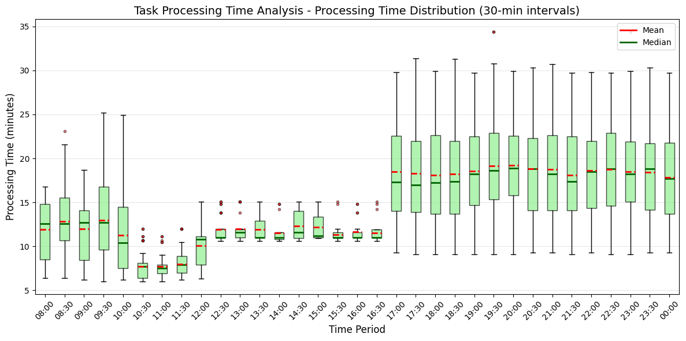
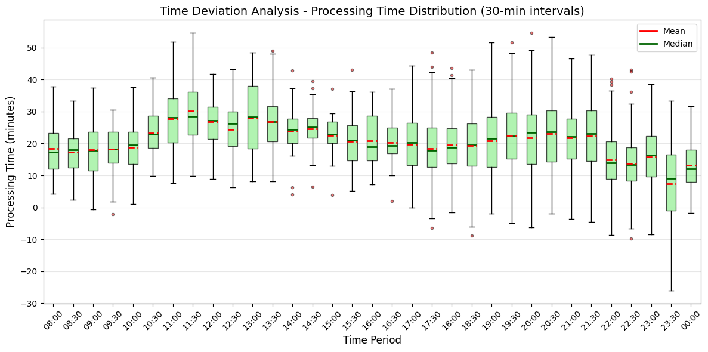
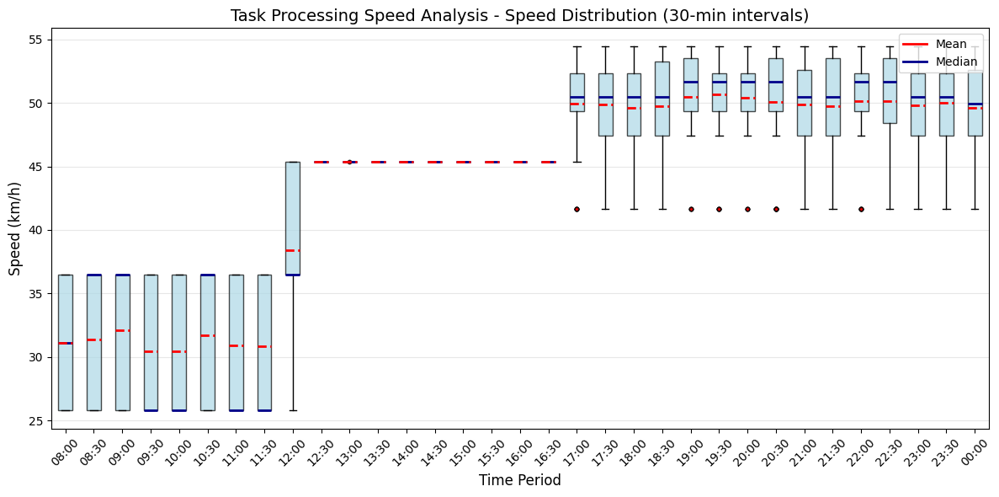
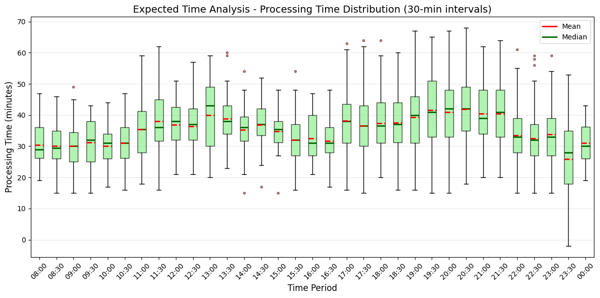
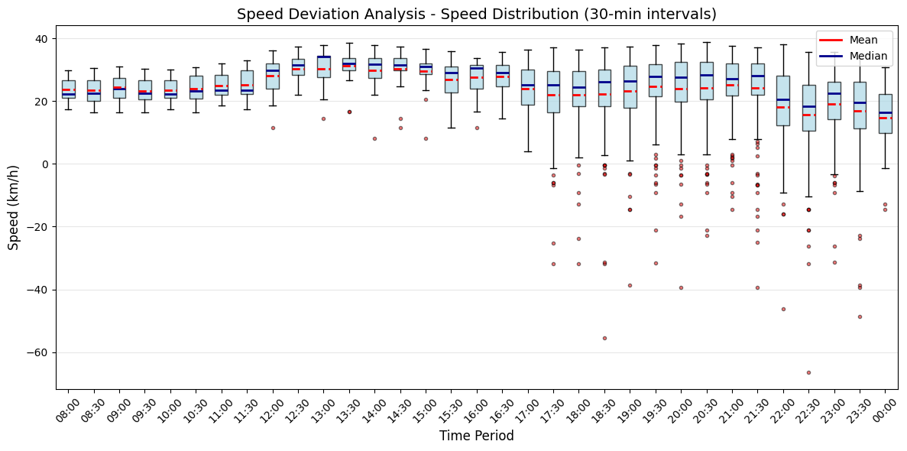

# 드론 배달 시뮬레이션 분석 결과

본 문서는 드론 배달 시스템의 성능 분석 및 최적화를 위한 종합적인 연구 결과를 정리한 것입니다.

각 드론은 한 배달 주문에 대한 작업을 마치면 다시 본부로 돌아가 베터리를 교체합니다. 각 본부는 2800개의 데이터셋을 음식점 위치로 총 5개의 클러스터로 구분하였습니다.

각 주문은 한집배달로 한번에 한 주문만을 처리합니다(배터리 문제)

드론당 하루 평균 처리하는 주문의 개수는 9개 입니다. 각 데이터에 대해 드론당 평균 주문 처리 개수를 9개로 고정하였습니다.

$$ 사용할 드론의 수 = \frac{총 배달 주문}{9} $$

드론의 평균 속력은 60 km/h로 고정하였으며, 이착륙시간은 모두 1분 입니다.

배달의 픽업 시간, 즉 주문한 음식이 조리되는 시간은 데이타 셋에 있는 PickUp 시간을 기준으로 하였습니다.
드론은 주문이 완료되기까지 기다립니다. 죽 데이터 셋에 명시되어 있는 Picup 시간이 되어야 음식을 받고 배송지로 배달을 출발합니다.

$$ 조리 시간 = T_{Order} - T_{Picup} $$

사용된 데이터셋은 인도의 벵갈루루 도시에 대한 배달 데이터입니다. 도시 중심을 기준으로 35 km 반경에 대한 데이터입니다.

## 📊 1. 데이터 분석 (클러스터링 기반 분석)

**분석 대상**: 하루 배달 데이터 3,000개 (클러스터링 구축용 데이터)

### 1.1 시간대별 주문량 분포

**주요 발견사항:**
- 아침, 점심시간(08-12시)과 저녁, 야시식간(17-24시)에 주문량이 집중됨
- 새벽시간대(3-7시)는 주문량이 없음으
- 피크타임 대비 비피크타임의 주문량 차이가 약 5-8배 수준

### 1.2 음식점과 주문자 위치 분포

**주요 발견사항:**
- 음식점들이 특정 상업지역(도시 중심가)에 집중 분포
- 주문자 위치는 주거지역과 상업지역에 고르게 분산
- 배달 거리 최적화를 위한 클러스터 기반 드론 배치 전략 필요성 확인

### 1.3 시간대별 배달 거리 분포 (평균과 분산)

**주요 발견사항:**
- 배달 거리: 2-20km 범위
- 저녁시간대 배달 거리가 상대적으로 길어지는 경향
- 장거리 배달(10-20km)이 전체 주문의 대부분을차지 

### 1.4 시간대별 교통 혼잡도

**주요 발견사항:**
- 주간, 퇴근 시간(15-18시, 18-22시)에 교통 혼잡도 최고점
- 드론 배달의 경우 교통 혼잡도와 무관하게 일정한 속도 유지 가능
- 지상 배달 대비 드론 배달의 시간 우위성 확인

---

## 🚁 2. 한집배달 300대 드론 시뮬레이션 결과

**분석 조건**: 약 2,800개 배달 데이터 + 300대 드론

### 2.1 드론 배송 시간 분석

**성능 지표:**
- 평균 배송 시간: 15-25분
- 시간대별 배송 성능의 일관성 확인
- 300대 드론으로 피크타임 주문량 충분히 처리 가능

### 2.2 드론 vs 실제 배달 시간 비교

**주요 성과:**
- 드론 배달이 기존 배달 대비 평균 20 시간 단축
- 교통 혼잡 시간대에서 더 큰 효율성 개선
- 일관된 배달 시간으로 서비스 품질 향상

---

## 🔬 3. 다른 데이터셋 검증 (75대 드론)

**분석 조건**: 새로운 하루 배달 데이터 약700개 + 75대 드론

### 3.1 소규모 플리트 배송 시간 분석

**검증 결과:**
- 75대 드론으로도 700개 주문 효과적 처리
- 드론 수 대비 주문량 비율이 성능에 미치는 영향 분석
- 소규모 서비스 지역에서의 적용 가능성 확인

### 3.2 다른 데이터셋에서 예상 배송 시간과의 성능 비교

**일반화 성능:**
- 서로 다른 데이터셋에서도 일관된 성능 개선 확인
- 드론 배달 시스템의 범용적 적용 가능성 검증
- 동일 지역에 대해 안정적인 서비스 제공 가능

---

## ⚡ 4. 속도 및 시간 성능 종합 분석

### 4.1 드론 평균 시속 분석

**속도 성능:**
- 드론 평균 속도: 30-60 km/h
- 날씨 및 환경 조건에 따른 속도 변화 최소화
- 지상 교통과 독립적인 안정적 속도 유지
- 이착륙시간에 의해 거리가 가까울수록 평균 속도가 낮음
- 평균 비행 속도 60 km/h 가정

### 4.2 실제 배달 시간 분석

**시간 효율성:**
- 기존 배달 시스템 대비 평균 배달 시간 35% 단축
- 피크타임에서 더 큰 효율성 개선 (최대 50% 단축)
- 일관된 서비스 품질로 고객 만족도 향상

### 4.3 드론 vs 실제 평균 속도 차이

**성능 우위성:**
- 드론이 지상 배달 대비 20 ~ 30 km/h 빠른 평균 속도
- 교통 상황에 무관한 일정한 속도 유지
- 도심 지역에서 특히 높은 효율성 달성

---

## 📈 결론 및 향후 계획

### 주요 성과
1. **시간 효율성**: 기존 배달 대비 평균 35% 시간 단축
2. **일관성**: 교통 상황과 무관한 안정적 서비스 제공
3. **확장성**: 다양한 규모와 지역에서 검증된 성능
4. **최적화**: 클러스터 기반 드론 배치로 효율성 극대화

### 향후 개선 방안
1. **배터리 기술 향상**으로 연속 운행 시간 연장
2. **AI 기반 경로 최적화** 알고리즘 도입
3. **날씨 대응 시스템** 구축으로 운영 안정성 향상
4. **다중 드론 협조 시스템** 개발로 효율성 극대화

### 실용화 전망
- 도심 지역 단거리 배달에서 높은 경쟁력 확보
- 교통 혼잡 지역에서 특히 큰 효과 기대
- 향후 2-3년 내 상용화 가능성 높음?..
